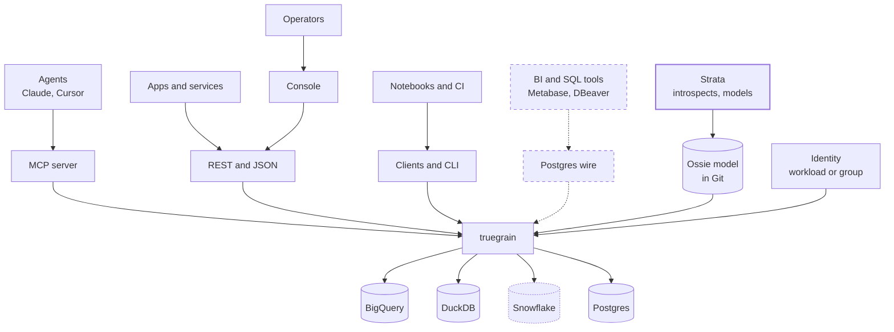
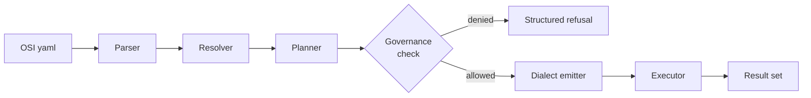
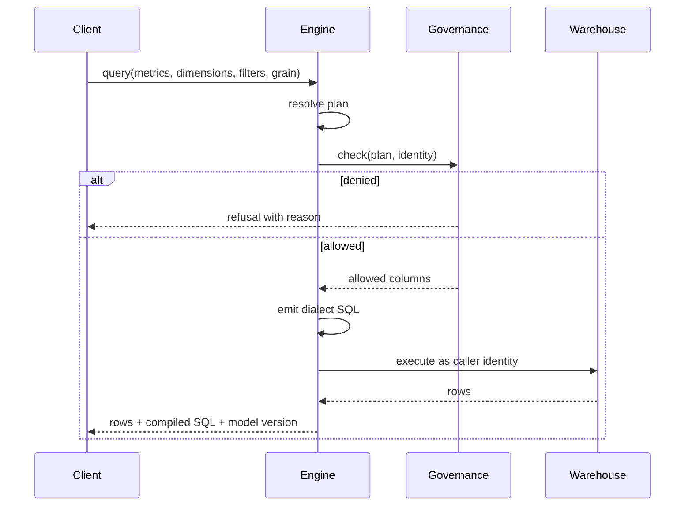

# 02 Architecture

## Component topology



Dotted is unverified execution. Snowflake, Databricks, ClickHouse, Athena,
Trino and Redshift all have emitters and golden SQL; Snowflake also has an
executor, over the SQL REST API, which has never run against a real account.
The other five have no executor at all. BigQuery, Postgres and DuckDB execute,
and Postgres and DuckDB are both checked against the same fixture in CI on
every run. Strata is a separate product that writes the model this reads.

Clients never touch the warehouse. The engine never holds business logic that
is not in the model repository.

## Internal pipeline



### 1. Parser

OSI YAML in, typed intermediate representation out. Every error carries file and
line. No inference, no defaults that hide mistakes. Unknown OSI constructs that
v1 does not support produce an explicit unsupported error rather than being
silently ignored.

### 2. Resolver

Builds the join graph from entity declarations and validates the model as a
whole:

- every source has a declared grain and a primary entity
- shared entity names actually match across sources
- every join declares cardinality
- no ambiguous join path between any pair of sources

Ambiguity is a compile error. The engine never guesses a join path.

### 3. Planner

Input: `(metrics, dimensions, filters, grain, limit)`. Output: a dialect-free
plan object.

Responsibilities:

- choose the join path
- decide aggregate-then-join versus join-then-aggregate
- refuse or rewrite any plan that would fan out a sum
- reject non-additive measures requested at an incompatible grain
- push filters to the correct stage, pre or post aggregation

Keep this component free of SQL strings so it can be unit tested without a
database. This is where correctness lives and where the test suite is densest.

### 4. Governance gate

Sits between planner and emitter. Takes the plan and the caller identity,
resolves column-level access, and either passes the plan through or returns a
structured refusal. Detailed in `05-governance.md`.

### 5. Dialect emitter

One interface, one implementation per warehouse.

```go
type Dialect interface {
    Name() string
    Emit(plan *Plan) (string, []Param, error)
    Capabilities() Capabilities
}
```

`Capabilities` declares what the warehouse supports, so the planner can refuse
cleanly rather than emitting SQL that fails at runtime.

### 6. Executor

Opens a connection as the calling identity, runs the SQL, streams results back
through whichever interface made the request. Connection pooling is per
identity, not global.

## Request lifecycle



Every successful response includes the compiled SQL and the model version that
produced it. This is not a debug feature. It is how users build trust in the
layer and how parity disputes get settled.

## Deployment

**Server mode.** One container, `ghcr.io/rk-chavali/truegrain`. Distroless and
non-root, published for amd64 and arm64 with a build attestation tying the
image to the workflow and commit that produced it. The model comes from a path
in the image or a mounted volume. It scales to zero on Cloud Run.

```bash
docker run --rm -v "$PWD:/models" ghcr.io/rk-chavali/truegrain:v0.3.0   serve rest -models /models -addr 0.0.0.0:8080
```

**CLI mode.** The same binary run directly, for CI and for a laptop. Six static
binaries per release across Linux, macOS and Windows on both architectures.

The rule: **if governance matters, it must be server mode.** Every command the
CLI offers runs with whatever credentials the person holds, so the gate is
advisory there. A caller who can run the CLI can query the warehouse directly
and skip it entirely.

Two things a deployment has to know:

- **A model change is picked up without a restart**, with `-reload 30s`. The
  workspace digest is re-read on that interval and the new model is served if
  it changed. A model that will not load is reported once and the previous one
  keeps answering, because the alternative is a typo taking down a layer every
  dashboard reads from. Off by default.
- **Asynchronous jobs are node-local.** The job store is one in-memory map, so
  behind a load balancer a caller can submit to one replica and poll another
  and get a 404 for a job that is running. Run one replica, or use the
  synchronous endpoint.

## Language choice

Go.

The compile step is sub-millisecond. All wall-clock latency is the warehouse
round trip, so language choice is about distribution, not speed. Go gives a
single static binary, good drivers for the target warehouses, and a solid MCP
library.

It also made the container and the six release binaries close to free, which
matters more than it sounds: the answer to "how do I run this" is one download
with nothing to install alongside it.

## Repository layout

```
/cmd/truegrain       one binary: validate, compile, query, health, diff, serve
/internal/osi        Ossie parser and IR
/internal/workspace  namespace composition, imports, exports, digests
/internal/resolve    join graph, schema, validation
/internal/plan       planner and refusals
/internal/govern     governance gate, policy, audit
/internal/gcp        BigQuery policy tag lookups
/internal/dialect    duckdb, bigquery, postgres, snowflake
/internal/exec       warehouse execution: duckdb, bigquery, postgres
/internal/engine     the composition every interface is handed
/internal/observe    logging and telemetry, and the only place either happens
/internal/config     truegrain.yaml
/internal/version    build information
/internal/serve/mcp
/internal/serve/rest
/api/openapi.yaml    the contract clients are built against
/testdata/fixtures   parity fixtures
/testdata/golden     compiled SQL snapshots, four dialects
/testdata/workspace  the two-team fixture workspace
/action.yml          the GitHub Action
/docs                this folder
```

One binary, not two. `internal/serve/pgwire` does not exist: the Postgres wire
protocol is a design, not code. See `04-interfaces.md`.

The client libraries and the console are separate repositories, because a Go
module's import path is its repository path: a client sharing this repository
would pull the BigQuery, OIDC and MCP dependencies into anyone who installed
it, and the whole point of the Go client is that it adds nothing to your
dependency tree.

- `truegrain-python`, `truegrain-typescript`, `truegrain-go`
- `truegrain-console`
