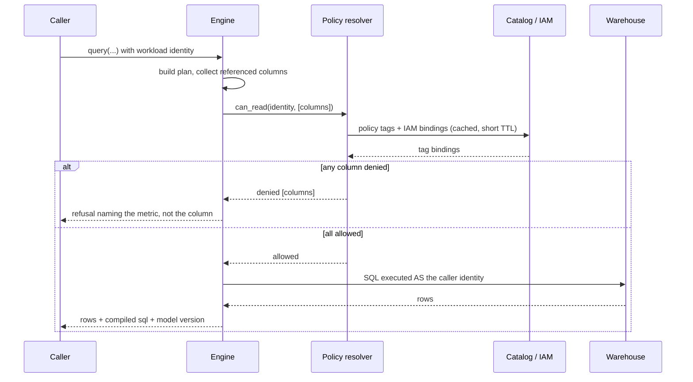

# 05 Governance

The part that makes this credible in an enterprise, and the part most semantic
layers get wrong by deferring entirely to the warehouse.

## Principle

**Resolve access at compile time. An unauthorized plan never becomes SQL.**

Execution-time enforcement is a second line of defense, not the first. If the
only protection is the warehouse rejecting the query, then the query text, the
schema, and the shape of the denial have already leaked, and an agent retrying
in a loop produces a stream of failures rather than one clear refusal.

## Enforcement flow



## BigQuery specifics

- Column-level security is enforced through policy tags from a Data Catalog
  taxonomy. Reading a tagged column requires Fine-Grained Reader on that tag.
- The resolver reads column-to-tag bindings from
  `INFORMATION_SCHEMA.COLUMN_FIELD_PATHS` plus the taxonomy, and the caller's
  bindings from IAM.
- Resolution is cached per identity for 60 seconds by default, never extended
  on read, and a cache miss is always preferred to a stale allow. A cached
  positive decision outliving a revoked grant is an access control bypass, so
  the TTL is the bound on how long that window can be.
- A column with no policy tag is readable, which is what BigQuery itself does.
  A computed field requires every tag on the table it reads from.
- A lookup failure is an error and never permission. If the tag cannot be
  resolved the query does not run. Where the failure is permanent, such as an
  identity this engine can never impersonate, the refusal says so and is
  classified as not retryable, or an agent waits forever for a deployment
  problem to fix itself.
- Row-level security in BigQuery applies at execution. Let it. The engine does
  not attempt to replicate row filters it cannot see, and it documents that
  row-level results may be narrower than the plan implies.

## Denial behavior

On a denied column, the options are:

1. **Fail loudly (default).** Return a refusal naming the metric or dimension
   the caller cannot access, and the tag or policy that governs it if the caller
   is allowed to know that.
2. **Drop the dimension.** Only when explicitly configured per model, and the
   response must flag that it was narrowed.
3. **Silent nulls.** Never. This is the worst option and produces wrong numbers
   that look right.

Do not leak schema in the refusal. Name the semantic object, not the physical
column, unless the caller already has metadata access to it.

## Identity model

Cross-system access is workload to workload. Grants go to service accounts or
groups, never individual humans, because people change teams and per-human
deprovisioning becomes unmanageable.

- The engine authenticates the caller, obtains their workload identity, and
  **impersonates it** to reach the warehouse.
- Never a shared admin service account. That single choice would turn the engine
  from a governance control into a privilege escalation path, and it is the
  failure mode a reviewer will look for first.
- On GCP: service account impersonation or workload identity federation.
  Downscoped credentials where available.
- Connection pools are keyed per identity.
- The engine's own service account needs metadata read on the catalog and
  nothing else. It should not be able to read the data it governs.

## Cross-cloud

Aspiration, not description. Nothing below is implemented and no caller outside
GCP has ever been tested.

A caller running in AWS or Azure querying BigQuery should still have policy
tags enforced, and a warehouse vendor's own implementation has no incentive to
build that. It remains the most defensible thing on the roadmap and it is not
on the roadmap yet.

What does work today: a caller reaching this engine from anywhere has their
column access resolved by asking Data Catalog **as them**, which is the
mechanism the rest of this would be built on. What is unproven is whether that
holds for a non-GCP identity, because only Google identities have been tried.

Constraints that would carry over:

- Warehouse to warehouse, not via storage buckets. Once data lands as files the
  tag enforcement is gone.
- No intermediate Iceberg or Delta catalog layer.
- Scope is any external engine reaching BigQuery, including Snowflake and
  Databricks, not just AWS.
- Identity is workload or group based, per the model above.

### Boundary with Crossbind

This was a plan to import a separate Crossbind library for policy resolution
and cross-cloud identity. **It did not happen.** truegrain has no dependency on
Crossbind and the policy resolver is `internal/govern` plus `internal/gcp`,
written here.

The decision stands on its own merits either way: the resolver never evaluates
a tag's IAM policy locally, it impersonates the caller and asks Data Catalog as
them. Evaluating locally would miss bindings inherited from the project, folder
and organization, conditional bindings, and group expansion, so it would report
access the warehouse refuses and refuse access it allows.

## Multi-warehouse abstraction

Every warehouse gets one implementation of:

```go
type PolicyResolver interface {
    CanRead(ctx context.Context, id Identity, cols []Column) (Decision, error)
    Capabilities() PolicyCapabilities
}
```

- **BigQuery**: policy tags, column-level security, row access policies
- **Snowflake**: masking policies, row access policies
- **Postgres**: column grants, row-level security
- **DuckDB**: none, and `Capabilities()` must say so honestly

Where a warehouse cannot enforce something, the engine says so in
`GET /v1/health` and in the CLI, rather than implying a guarantee it does not
have. Overstating a governance guarantee is worse than not offering it.

## Audit

Every decision is recorded: caller identity, model version, namespace, metrics
and dimensions requested, the decision, the compiled SQL hash, the warehouse
job id, row count, bytes billed and duration.

Five decisions, not two:

| Decision | Meaning |
|---|---|
| `allowed` | ran, and returned rows |
| `compiled` | the caller read the SQL without running it |
| `refused` | correctness: this cannot be answered accurately |
| `denied` | access: this caller may not read a field |
| `error` | the warehouse or the engine broke |

**`refused` and `denied` are deliberately separate.** Denied is about access.
Refused is about correctness, and carries the refusal code, the retry class,
the reason and the hint naming a question that can be answered. Collapsing them
would make a governance review count every fan-out as an access incident, and a
report like that stops being read.

Refusals were not recorded at all until v0.2.0: they happen in `Compile`,
before the gate, so nothing was writing them down. The most distinctive thing
this engine does left no trace.

What is deliberately absent, and must stay absent: **filter values, the
compiled SQL text, and result rows.** A filter value is a customer email or an
account number, and the SQL embeds the schema. The hash is enough to prove
which statement ran and to correlate with the warehouse's own job log, without
this file becoming a second copy of the data it governs. The same rule binds
telemetry, and `internal/observe` enforces it by shape rather than by
convention.

### Sinks

`-audit` appends JSON lines to a file. That is the whole of it today: there is
no Cloud Logging sink, and an earlier version of this document said there was.
A server additionally keeps a bounded in-memory window so an operator can read
recent decisions over the API without shelling into the container.

An audit sink that fails degrades the record and never the answer: a sink that
panics is recovered from rather than taking the query path with it.

### Reading it back

`GET /v1/audit`, off until `-audit-readers` names who may read it. The record
contains every caller's activity, so serving it discloses what other teams
query and which fields are protected. See `04-interfaces.md`.
